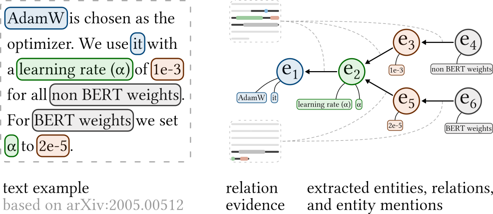

# Hyperparameter extraction from ML papers

### General

##### Data

* Ours
    * Waiting for reply from BSc student
    * Similar to [version 1](https://sigmathling.kwarc.info/resources/artifact-parameter-dataset/) data but with an additional entity type “context”
* Test methods on
    * SciERC: PL-Marker
    * SemEval 2022 Task 12 (Math)
    * SemEval 2021 Task 8 (Measurements)

##### Methods

* Baselines to compare to
    * PL-Marker (SciERC SOTA)
    * JBNU-CCLab (SemEval 2022 Task 12 SOTA)
    * LIORI (SemEval 2021 Task 8 SOTA)

##### Evaluation

* Our method vs baselines on datasets listed under “Data”.

### Organization

##### Repository

* Descriptive commit messages
* Everything in the master branch is ok

##### Collaboration

* General communication: Slack
* TODOs: GitHub issues
* Code/Notes: GitHub
