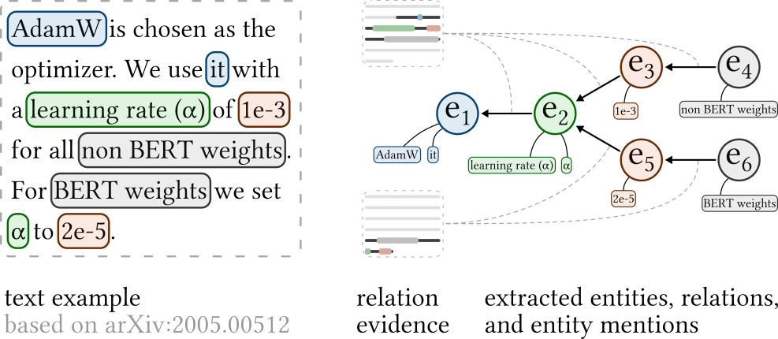

# HyperPIE

Hyperparameter Information Extraction from Scientific Publications



This repository contains the source code, data, and documentation for the ECIR paper “HyperPIE: Hyperparameter Information Extraction from Scientific Publications”.

## Contents

* **Documentation**
    * [Annotation guidelines](doc/annotation_guidelines.md)
    * [Dataset format](data/preprocessed_data_format.md)
    * [Prompt example zero-shot](doc/prompt_examples.md#Zero-shot)
    * [Prompt example few-shot](doc/prompt_examples.md#Few-shot)
* **Data**
    * Manually annotated data
        * [data](data/#README)
        * [format](data/preprocessed_data_format.md)
    * LLM completions
        * `code/hyperpie/llm/completion_cache.json.xz`
        * `code/hyperpie/llm/completion_cache_few_shot.json.xz`
* **Code**
    * [Fine-tuned models](code/PL-Marker/)
    * [LLMs](code/hyperpie/)

## Cite as

```
@inproceedings{Saier2024HyperPIE,
  title         = {{HyperPIE: Hyperparameter Information Extraction from Scientific Publications}},
  author        = {Saier, Tarek and Ohta, Mayumi and Asakura, Takuto and F\"{a}rber, Michael},
  year          = {2024},
  booktitle     = {Proceedings of the 46th European Conference on Information Retrieval (ECIR ’24)},
}
```
